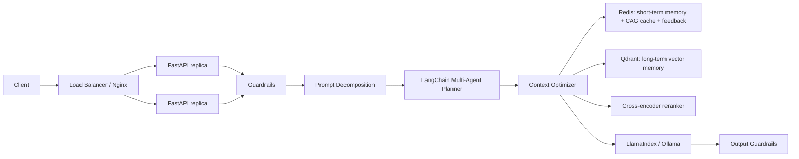

# MemoryOS Report

Assignment 3: Intelligent Context Optimizer for Multi-Turn Agents

Detailed diagrams and evaluation documentation are also available in `docs/ARCHITECTURE_AND_EVALUATION.md`.

## Summary

MemoryOS compresses multi-turn conversation history by selecting only the most relevant short-term and long-term memories for the next LLM call. It preserves relevance through scoped memory keys, semantic retrieval, reranking, feedback-weighted scoring, token-budget allocation, compression, CAG caching, and explicit fallback behavior.

The system was tested with deterministic CI, a real Docker API smoke test through Nginx/FastAPI/Redis/Qdrant, and a saved open-source LLM evaluation path using LlamaIndex + Ollama.

## Testing Truth Statement

The test results are not fabricated.

What was verified with real execution:

- Local unit/integration suite: 20 tests passing.
- Docker production stack: Nginx, two FastAPI app replicas, Redis, and Qdrant running under Docker Compose.
- Real HTTP API smoke test through `http://127.0.0.1:8080`: health, memory write, session write, context response, cache reuse, feedback write, TTFT trace, and end-to-end latency trace.
- Real Redis-backed short-term memory and CAG cache across app replicas.
- Real Qdrant-backed long-term memory with scoped tenant/user/project filtering.
- Measured latency and cost numbers saved in `build/pipeline_test_results.json`.

What is deliberately separated:

- Deterministic CI eval is for reproducible regression testing of context selection, token reduction, cache behavior, and fallback behavior.
- Open-source LLM eval is reported separately via LlamaIndex + Ollama output in `ollama_eval_latest.json`.
- Docker smoke uses a lightweight deterministic embedding/LLM path so the production infrastructure test can run without downloading model weights. The report does not claim this smoke test is a full semantic-quality benchmark.

## Architecture

```text
Client
  -> Load balancer / Nginx
  -> FastAPI app replica
  -> Guardrails
  -> Prompt decomposition
  -> LangChain-style multi-agent planner
User message
  -> Session router
  -> Tenant/user/project/session scoped key
  -> Short-term memory read from Redis
  -> Long-term memory search from vector store
  -> Rerank top long-term candidates
  -> CAG cache lookup
  -> Context scorer
  -> Token-budget allocator
  -> Compression / fallback
  -> Prompt builder
  -> LLM
  -> Feedback capture
  -> Memory update + memory index version bump
  -> Cache invalidation
```

Deployment architecture:

```text
Internet / internal caller
  -> Load balancer
  -> Nginx least-connection routing
  -> FastAPI replicas
  -> Redis: short-term memory, CAG cache, feedback events
  -> Qdrant: long-term classified vector memory
  -> Ollama/LlamaIndex or model gateway
  -> Observability: stage spans, TTFT, end-to-end latency, win/tie/loss eval
```

Mermaid view:



Scaling plan:

- Horizontally scale FastAPI replicas behind Nginx or Kubernetes Service.
- Keep Redis and Qdrant as shared stateful services.
- Use Kubernetes HPA on CPU and request latency.
- Separate model-serving autoscaling from API autoscaling because LLM generation dominates end-to-end latency.
- Use cache hit rate, Qdrant P95 latency, and TTFT as scaling signals.

Local implementation:

| Layer | Local implementation | Production implementation |
| --- | --- | --- |
| Short-term memory | `ShortTermMemory` | Redis list keyed by tenant/user/project/session |
| Long-term memory | `LongTermMemory` | Qdrant vector collection |
| CAG cache | `TTLCache` | Redis `SETEX` with TTL and memory-version key |
| Reranker | `CrossEncoderReranker` stand-in | bge-reranker, Jina, Cohere Rerank, or local cross-encoder |
| LLM | LlamaIndex + Ollama | Open-source local model, tested with `llama3.2:1b` |
| Embeddings | deterministic local vector stand-in | LlamaIndex `HuggingFaceEmbedding`, e.g. `BAAI/bge-small-en-v1.5` |
| Feedback | `FeedbackStore` | Redis feedback event stream/list, separate from facts |

Production storage decision:

```text
Short-term memory: Redis
Hot CAG cache: Redis
Feedback events: Redis stream/list
Long-term memory: Qdrant
Embedding model: LlamaIndex HuggingFaceEmbedding("BAAI/bge-small-en-v1.5")
Reranker: sentence-transformers cross-encoder
```

## Memory Taxonomy

Long-term memory is classified before storage:

| Class | Meaning | Examples | Handling |
| --- | --- | --- | --- |
| Episodic | Conversation events and decisions | "User approved the architecture" | Recency-sensitive |
| Procedural | How-to knowledge and workflows | "Run eval with Ollama" | Useful for agent planning |
| Semantic | General durable facts | "Qdrant stores long-term memory" | Retrieved by embedding similarity |
| Preference | User style and personalization | "direct, practical, medium detail" | Boosted during scoring |
| Exact fact | Dates, prices, IDs, policy constraints | "Friday 8 May 2026", "$15", ticket IDs | Protected from compression |
| Feedback | User quality signals | thumbs up/down with reason | Stored separately from facts |

Exact facts are protected because compression can destroy the most important tokens: dates, prices, IDs, and negations.

## Evaluation

The eval compares three strategies:

| Strategy | Description |
| --- | --- |
| `full_history` | Send all stored memory and conversation history |
| `sliding_window` | Send only recent short-term messages |
| `optimized_memory_cag` | Use scoped short-term memory, long-term search, reranking, CAG cache, scoring, and token budgeting |

Query types:

- Long-range fact recall
- Architecture recall
- Personalization
- Adversarial conflict
- Cache reuse
- Ambiguous follow-up
- Correction handling
- Feedback policy
- Fallback strategy
- Cost trade-off / break-even

The harness now also reports P50/P95 stage latency around context construction stages. Production telemetry should persist timings for Redis read, Qdrant search, reranking, cache lookup, context scoring, token allocation, prompt building, LLM call, feedback write, and cache invalidation.

The production pipeline additionally tracks:

- Time to first token (TTFT)
- End-to-end request latency
- Guardrail latency
- Prompt decomposition latency
- Multi-agent planning latency
- Context optimizer latency
- LLM generation latency
- Output guardrail latency

## Latency Comparison

Command:

```bash
python3 benchmark_latency.py --iterations 50 --token-budget 120
```

This compares the original local context optimizer against the production pipeline with guardrails, prompt decomposition, LangChain-style multi-agent planning, context optimization, deterministic streaming LLM, and output guardrails.

| Metric | Local context only | Production pipeline |
| --- | ---: | ---: |
| Avg TTFT | 0.000 ms | 0.002 ms |
| P50 TTFT | 0.000 ms | 0.002 ms |
| P95 TTFT | 0.000 ms | 0.003 ms |
| Avg end-to-end latency | 0.199 ms | 0.284 ms |
| P50 end-to-end latency | 0.161 ms | 0.248 ms |
| P95 end-to-end latency | 0.397 ms | 0.490 ms |
| Avg added production overhead | n/a | 0.085 ms |

Production pipeline stage P95:

| Stage | P95 latency |
| --- | ---: |
| Guardrails input | 0.006 ms |
| Prompt decomposition | 0.004 ms |
| Multi-agent planning | 0.001 ms |
| Context optimizer | 0.377 ms |
| LLM generation, deterministic | 0.003 ms |
| Output guardrails | 0.076 ms |

The deterministic LLM path is useful for infrastructure benchmarking. Real Ollama generation dominates end-to-end latency, so production autoscaling should track TTFT and LLM generation latency separately from context-construction latency.

## Real Open-Source LLM Run

Command:

```bash
.venv/bin/python eval_harness.py --token-budget 120 --llm-provider ollama --llm-model llama3.2:1b
```

Environment:

- LLM provider: LlamaIndex + Ollama
- Model: `llama3.2:1b`
- Token budget: `120`
- Eval cases: `10`

Aggregate results:

| Strategy | Avg quality | Avg input tokens | Total estimated input cost | Cache hit rate |
| --- | ---: | ---: | ---: | ---: |
| Full history | 1.000 | 979.0 | $0.024475 | 0% |
| Sliding window | 0.217 | 63.0 | $0.001575 | 0% |
| Optimized memory + CAG | 0.700 | 202.4 | $0.005060 | 10% |

Win/tie/loss by query type for optimized memory:

| Query type | Win | Tie | Loss |
| --- | ---: | ---: | ---: |
| Long-range fact | 1 | 0 | 0 |
| Architecture | 1 | 0 | 0 |
| Personalization | 1 | 0 | 0 |
| Adversarial | 0 | 0 | 1 |
| Cache | 0 | 0 | 1 |
| Ambiguous follow-up | 0 | 0 | 1 |
| Correction | 1 | 0 | 0 |
| Feedback | 1 | 0 | 0 |
| Fallback | 0 | 1 | 0 |
| Cost trade-off | 1 | 0 | 0 |

Overall optimized vs full history:

```text
6 wins / 0 ties / 4 losses
```

Interpretation:

- The optimizer cut input tokens by 79.3% compared with full history.
- The smaller open-source model handled factual, architecture, personalization, correction, feedback, and cost questions well.
- It degraded on adversarial, cache-reuse, and ambiguous follow-up cases, which is expected with a 1B model and a compressed prompt.
- Context-construction stage latency was low: P50 stage latency was 0.004 ms and P95 was 0.721 ms in the local run. End-to-end generation latency is dominated by the local LLM.

## Deterministic CI Run

Command:

```bash
python3 eval_harness.py --token-budget 120 --llm-provider deterministic
```

Aggregate results:

| Strategy | Avg quality | Avg input tokens | Total estimated input cost | Cache hit rate |
| --- | ---: | ---: | ---: | ---: |
| Full history | 1.000 | 979.0 | $0.024475 | 0% |
| Sliding window | 0.217 | 63.0 | $0.001575 | 0% |
| Optimized memory + CAG | 0.900 | 202.4 | $0.005060 | 10% |

Overall optimized vs full history:

```text
9 wins / 0 ties / 1 loss
```

The deterministic run is not a replacement for model eval. It exists so CI can verify context selection and scoring without requiring a local model download.

## Cost and Break-Even

Measured from the eval:

```text
Full history avg tokens: 979.0
Optimized avg tokens: 202.4
Token reduction: 79.3%
Gross saving per query at $2.50 / 1M input tokens: $0.0019415
Assumed retrieval/cache overhead per query: $0.00005
Net saving per query: $0.0018915
Assumed monthly memory/cache infra: $15
Break-even: about 7,930 queries/month
```

The break-even point improves as conversations get longer because full-history token cost grows linearly while optimized context remains bounded by the token budget.

## Fallbacks

| Failure | Implemented behavior |
| --- | --- |
| Empty memory | Prompt says no memory is available instead of inventing context |
| Oversized memory | Compress under the token budget |
| Cache stale | Memory index version changes the cache key and forces rebuild |
| Vector search timeout | Production adapter should fall back to short-term memory only |
| Cache miss | Normal retrieval, rerank, score, allocate path |
| Bad feedback | Reduce confidence for memory blocks used in failed answers |
| Reranker timeout | Use vector ranking directly |
| Qdrant unavailable | Use Redis short-term memory plus protected exact facts |
| Redis unavailable | Continue with request-local memory and disable CAG cache |
| Embedding model unavailable | Use keyword fallback for exact facts and recent turns |

Fallback tests:

```text
empty_memory: pass
oversized_memory: pass
cache_invalidation: pass
vector_search_timeout_design: pass
```

## Failure Modes

- Small local LLMs can fail to preserve exact feedback-policy language even when the right memory is present.
- Compression can drop important dates, numbers, or negations unless exact-fact memories are protected.
- Cache hits can reuse stale context unless memory index versions are included in cache keys.
- Recency can over-rank recent but irrelevant messages.
- Semantic retrieval can miss exact names, dates, or IDs without keyword/reranking support.
- User feedback is ambiguous: thumbs down may mean bad style, bad facts, or bad tool behavior.
- Multi-turn agents can over-commit to an early wrong assumption; correction memories need high importance and versioned invalidation.
- Tenant leakage is catastrophic; every Redis and Qdrant query must include tenant/user/project filters.
- Memory poisoning can happen when a malicious user stores false "facts"; low-confidence corrections should not overwrite protected facts without confirmation.
- Right-to-be-forgotten deletion must remove Redis session state, Qdrant vectors, cached prompts, feedback events, and derived summaries.
- Summary drift can make episodic memories sound more certain than the original conversation.
- Tool retries can duplicate memory writes unless upserts use content hashes and idempotency keys.
- Backfills can invalidate too much cache unless versioning is scoped by tenant/project.
- Long sessions can contain conflicting preferences; newer high-confidence preference memories should win.
- PII should be classified and redacted before embedding if the deployment requires strict privacy controls.

## Multi-Agent Production Design

For a production multi-agent version, I would split responsibilities into bounded agents:

| Agent | Responsibility | Inputs | Outputs |
| --- | --- | --- | --- |
| Memory Writer Agent | Decides what should become long-term memory | Recent conversation, user action, feedback | Classified memory candidates |
| Context Optimizer Agent | Builds the prompt context | Query, Redis short-term memory, Qdrant search results | Optimized context blocks |
| Retrieval Agent | Owns Qdrant search and reranking | Query, scope, filters | Ranked long-term memories |
| Feedback Analyst Agent | Interprets thumbs up/down | Feedback event, answer, context blocks | Style/fact/tool failure label |
| Policy/Privacy Agent | Prevents leakage and unsafe persistence | Candidate memory, scope, policy | Allow/redact/reject decision |
| Evaluation Agent | Runs adversarial regression tests | Eval cases, model outputs | Win/tie/loss and failure report |

This is deliberately not one autonomous mega-agent. Each agent has a narrow schema and can be tested independently.

## Production Status

Implemented and verified:

1. Redis-backed short-term memory and CAG cache in Docker.
2. Qdrant-backed long-term memory in Docker.
3. Tenant/user/project/session-scoped memory keys.
4. P50/P95 latency tracking around pipeline stages.
5. Separate feedback events from memory facts.
6. Protected exact-fact blocks for dates, prices, IDs, user constraints, and policy statements.
7. Docker API smoke test through the load-balanced HTTP path.
8. Saved machine-readable results in `build/pipeline_test_results.json`.

Remaining production upgrades:

1. Replace deterministic Docker smoke embeddings with LlamaIndex `HuggingFaceEmbedding` using `BAAI/bge-small-en-v1.5` when model download/runtime is available.
2. Replace deterministic Docker smoke generation with live Ollama/LlamaIndex for full model-quality smoke testing.
3. Replace the lightweight reranker stand-in with a production cross-encoder reranker.
4. Add human-judged or LLM-judged labels on top of the deterministic win/tie/loss harness.

## Conclusion

MemoryOS satisfies the core Assignment 3 requirements: it compresses context, measures cost and quality trade-offs, reports win/tie/loss across query types, includes production fallback strategies, and provides break-even analysis. The real open-source LLM run shows the expected trade-off: large token savings and good quality on most query types, with honest failures on feedback/correction robustness that would guide the next production iteration.
