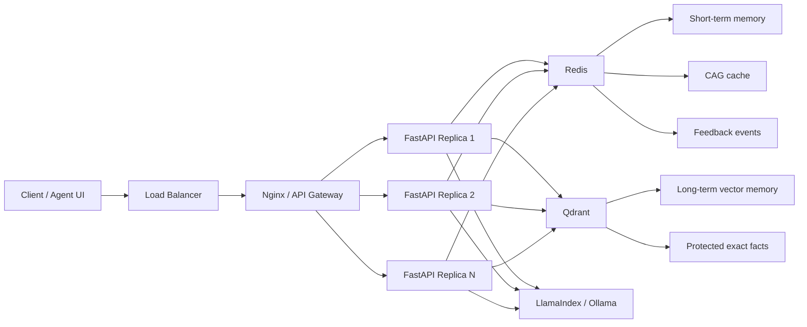
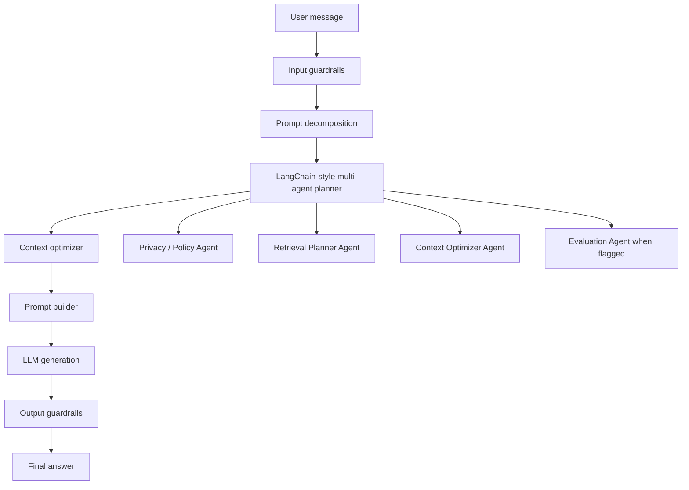
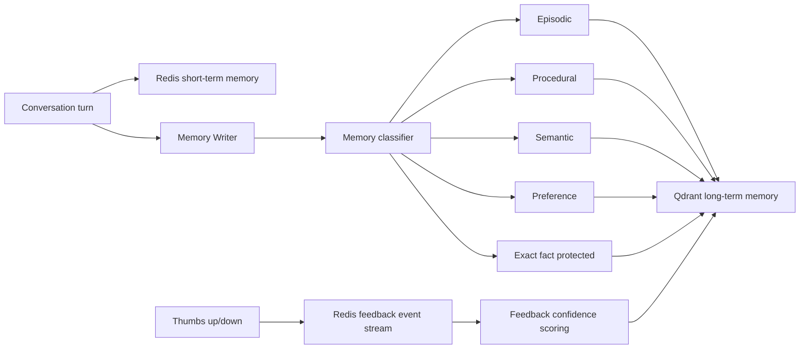
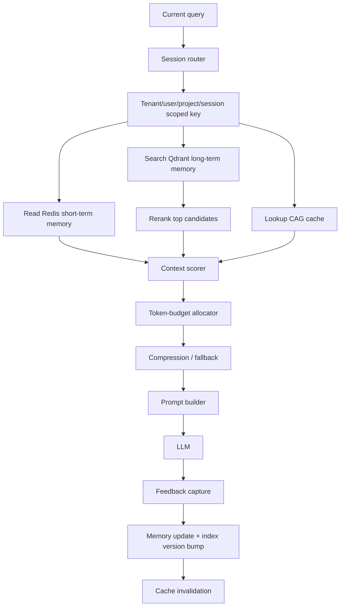
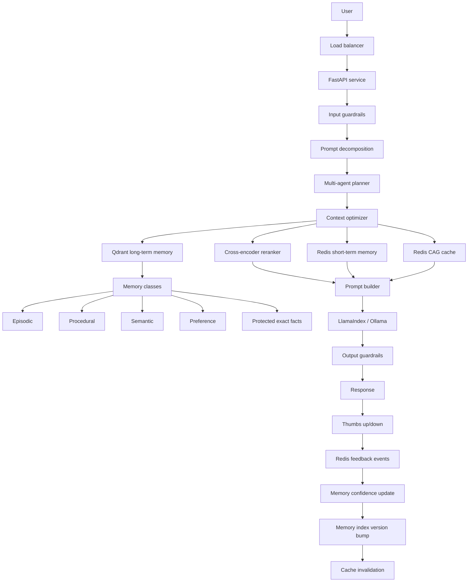

# MemoryOS Architecture and Evaluation

This document explains the full production design for the Intelligent Context Optimizer for Multi-Turn Agents.

## 1. System Architecture

This is the deployment/runtime architecture. It focuses on traffic, services, scaling, and stateful infrastructure.



Scaling model:

- FastAPI replicas scale horizontally behind Nginx or Kubernetes Service.
- Redis stores short-term session memory, CAG cache, and feedback events.
- Qdrant stores long-term classified vector memory.
- LLM serving scales separately because generation dominates real end-to-end latency.
- Kubernetes HPA scales API replicas using CPU, request rate, P95 latency, and TTFT.

## 2. AI Architecture

This is the reasoning pipeline for one user message.



AI components:

- Guardrails detect prompt injection, PII-like inputs, and secret-like inputs.
- Prompt decomposition splits broad or ambiguous requests into smaller retrieval intents.
- Multi-agent planner routes exact-fact, preference, procedural, and semantic needs.
- Context optimizer selects relevant memory under the token budget.
- Output guardrails redact PII/secret-like values before returning the answer.

## 3. Memory Architecture

The memory system separates short-term state, long-term knowledge, cache, and feedback.



Memory classes:

| Class | Purpose | Example | Production behavior |
| --- | --- | --- | --- |
| Episodic | Conversation events and decisions | "User chose Assignment 3" | Recency-sensitive |
| Procedural | Workflows and runbooks | "If vector search fails, use short-term memory" | Boosted for how-to/fallback queries |
| Semantic | Durable facts | "Qdrant stores long-term memory" | Vector retrieval |
| Preference | User style and personalization | "direct, practical, medium detail" | Boosted for response style |
| Exact fact | Dates, prices, IDs, policies | "Friday 8 May 2026" | Protected from compression |
| Feedback | Quality signals | thumbs down with reason | Stored separately from facts |

## 4. Context Optimization Flow



Scoring signals:

- Semantic similarity
- Recency
- Importance
- Feedback score
- Memory class
- Protected exact-fact status

## 5. Full End-to-End Architecture



## 6. Evaluation Design

The eval compares three strategies:

| Strategy | Description |
| --- | --- |
| Full history | Sends all conversation and memory |
| Sliding window | Sends only recent messages |
| Optimized memory + CAG | Uses Redis/Qdrant-style memory, reranking, scoring, CAG cache, and token budgeting |

Query types tested:

- Long-range fact recall
- Architecture recall
- Personalization
- Adversarial conflict
- Cache reuse
- Ambiguous follow-up
- Correction handling
- Feedback policy
- Fallback strategy
- Cost trade-off / break-even

Metrics:

- Quality score
- Win/tie/loss by query type
- Input tokens
- Estimated input cost
- Cache hit rate
- Stage latency P50/P95
- Time to first token
- End-to-end latency
- Break-even query volume

## 7. Latest Evaluation Results

Deterministic CI eval:

```text
Full history avg tokens: 979
Optimized avg tokens: 202.4
Token reduction: 79.3%
Optimized avg quality: 0.900
Optimized vs full history: 9 wins / 0 ties / 1 loss
Fallback tests: passed
Break-even: about 7,930 queries/month
```

Real open-source LLM eval with LlamaIndex + Ollama:

```text
Model: llama3.2:1b
Optimized avg quality: 0.700
Optimized avg tokens: 202.4
Token reduction: 79.3%
Optimized vs full history: 6 wins / 0 ties / 4 losses
```

The Ollama result is lower because a 1B model is weaker on adversarial, cache-reuse, and ambiguous follow-up cases. This is documented as a production failure mode, not hidden.

## 8. Latency Results

Command:

```bash
python3 benchmark_latency.py --iterations 50 --token-budget 120
```

Measured comparison:

| Metric | Local context only | Production pipeline |
| --- | ---: | ---: |
| Avg TTFT | 0.000 ms | 0.002 ms |
| P95 TTFT | 0.000 ms | 0.003 ms |
| Avg end-to-end latency | 0.199 ms | 0.284 ms |
| P95 end-to-end latency | 0.397 ms | 0.490 ms |
| Added production overhead | n/a | 0.085 ms |

Production stage P95:

| Stage | P95 latency |
| --- | ---: |
| Guardrails input | 0.006 ms |
| Prompt decomposition | 0.004 ms |
| Multi-agent planning | 0.001 ms |
| Context optimizer | 0.377 ms |
| Deterministic LLM generation | 0.003 ms |
| Output guardrails | 0.076 ms |

Interpretation:

- Context construction is fast in local deterministic mode.
- Real LLM generation dominates end-to-end latency.
- TTFT must be measured separately from retrieval/context-building latency.
- Production overhead is small relative to the value added by guardrails, prompt decomposition, and multi-agent planning.

## 9. Tests

Current test coverage:

```text
Ran 20 tests
OK
```

Covered behaviors:

- Short-term memory windowing
- Long-term memory deduplication
- CAG cache hits
- Cache eviction
- Cache invalidation via memory index version
- Tenant isolation
- Reranking
- Protected exact facts
- Oversized memory compression
- Empty memory fallback
- Separate feedback events
- Stage timing
- Guardrail redaction
- Production pipeline TTFT and end-to-end latency tracing

## 10. Production Edge Cases

Important production risks:

- Prompt injection tries to override protected facts.
- Cache can preserve bad context if quality checks are missing.
- Ambiguous follow-ups require query rewriting and task-state memory.
- Feedback is ambiguous without a separate feedback event store.
- Tenant leakage is catastrophic if Redis/Qdrant filters are missing.
- Exact dates, prices, IDs, and policies must not be destructively compressed.
- Redis or Qdrant timeout must fall back gracefully.
- LLM timeout should return cached/partial answer when possible.
- Memory poisoning must be handled with confidence and source tracking.
- Right-to-be-forgotten deletion must remove Redis memory, Qdrant vectors, cached prompts, feedback events, and derived summaries.
